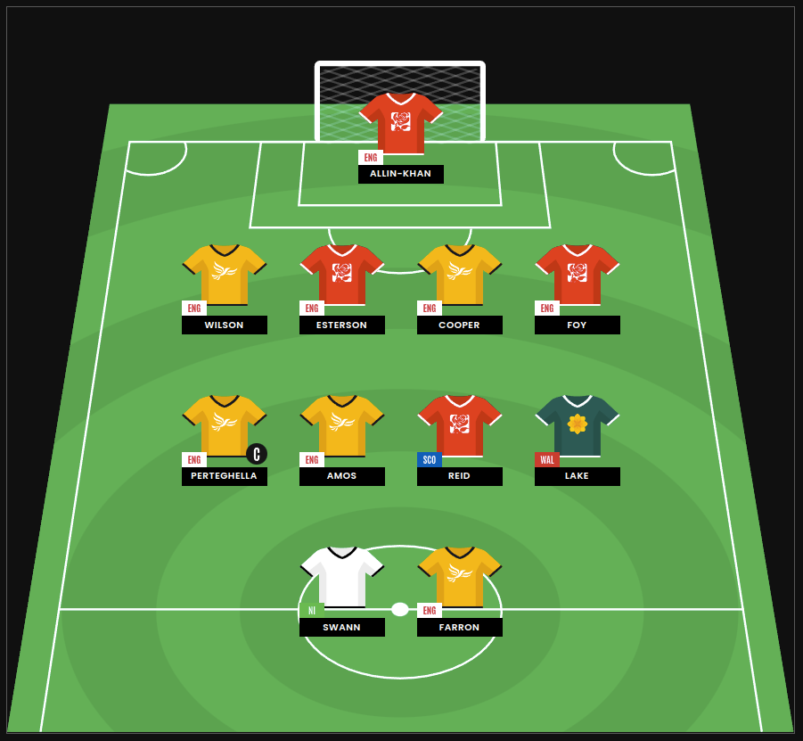
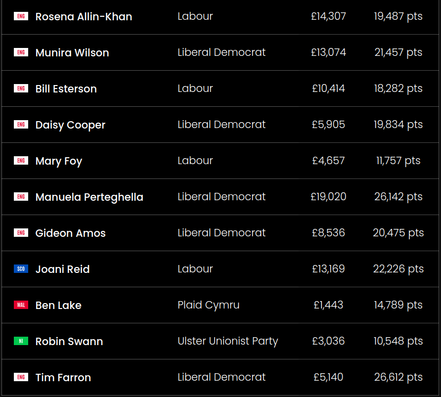

# PuLP Fantasy

## Overview

PuLP Fantasy is a project detailing how I relied on data to pick my team on a fantasy football-like game called 'Fantasy General Election'. It uses SQL to transform polling data from YouGov into the in-game price of each election candidate and how many points they could they could be expected to win. A 'knapsack' optimiser uses these values to find the best combination of players within the budget and other rules of the game. This approach helped me to come [7th place out of 10,853 players](https://fantasyelection.co.uk/league-table).

---

## The Game and Its Rules

The aim of Fantasy General Election was to build the highest-scoring team of 11 parliamentary candidates, based on the UK General Election in July.

1. **Team Composition**:
   - Formations must include at least one attacker, a non-MP trying to gain a seat.
   - Defenders and goalkeepers must be sitting MPs.
   - Anyone can be a midfielder.
2. **Budget**: 
    - £100,000 to spend on the team
    - Player prices are set by the constituency's existing majority
         (e.g. if a constituency had a 10,000 vote Labour majority, each candidate there would cost £10,000)
3. **Scoring**:
   - Points are only awarded to candidates who win in their constituency,
         (e.g. if a sitting MP wins by 15,000 votes, they would earn 15,000 points)
   - Non-MPs (attackers in-game) gain bonus points equal to the majority vote they overturned,
         (e.g. if a constituency had a 10,000 vote Labour majority and a Conservative candidate won by 5,000 votes, they would earn 15,000 points)
   - The team captain scores double points.
4. **Diversity Requirements**:
   - At least one candidate from England, Scotland, Wales and Northern Ireland.
   - No more than five candidates from the same political party.

---

## Data Sources

The project relies on two main data sources:

1. **YouGov’s Final MRP Poll for the 2024 Election**: YouGov was the only polling company to provide free projections of the vote share in every constituency in Britain.
2. **Notional Results for 2019 UK General Election**: Produced by Ralling and Thrasher at the University of Plymouth - it applies 2019 election results to updated constituency boundaries. This data was used by Fantasy General Election to set players' prices.

Both datasets were downloaded as CSV files.

---

## Project Workflow

### 1. Data Transformation - [transform_data.py](src/transform_data.py)

The `pandas` module reads the CSV files and converts them into dataframes.

`pandasql` is used to join and query the dataframes to create another one with useful data for the game. The columns created are:
- Constituency
- Winning_Party
- Projected_Points
- Price
- Position
- Country

Projected_Points is calculated by multiplying YouGov's estimate of the winning margin in the constituency by its population and turnout rate. Bonus points are added equal to the constituency's existing majority if it changes parties.

Price is simply equal to the constituency's existing majority according to the Rallings/Thrasher data.

Rows with null values in Projected_Points are removed as they would create problems later on with the optimisation - this included the Speaker's seat and those Northern Ireland, which YouGov doesn't cover.

The resulting dataframe is exported to a markdown table [(transformed_data.md)](data/transformed_data.md) to review, before it's converted to a list of dictionaries.

### 2. Picking a Candidate for Northern Ireland

YouGov’s MRP poll didn't cover Northern Ireland, and there wasn't any comparable constituency data to download. To address this, I relied on predictions from **Electoral Calculus**, which suggested only one constituency changing parties (South Antrim to the Ulster Unionist Party).

The UUP candidate was inexpensive at £3,036 and could fill the attacker role. Picking the Northern Irish candidate first left me with the following constraints to consider for the rest of the team:
- Player limit = 10
- Budget = 96,964
- Max same party = 5
- 1+ player from England, Scotland and Wales

### 3. Optimisation - [knapsack.py](src/knapsack.py)

The `knapsack.py` script invokes the function to transform the original data, and defines a knapsack problem to find the highest sum of Projected_Points within the constraints outlined above.

The first line in the function defines the knapsack problem with the aim of maximising the 'objective function'. The second line initialises a dictionary ready to map each constituency to a binary value - 1 if selected and 0 if not. The third line sets the 'objective function' to be the sum of Projected_Points values.

Following this, there is a line to add each of the constraints to the problem, before the .solve() method assigns the binary values to every constituency. The function returns the constituencies with a value of 1.

I chose to use the `PuLP` library to tackle the knapsack problem because it was relatively simple to construct after seeing a few examples, and more importantly, it automatically finds an optimal way to solve the problem within a second. Before trying this library, I'd created a 'brute force knapsack' which would have calculated every possible combination of the 600+ candidates, except this would have taken my laptop over 100,000 years.

At the bottom of the script, the knapsack function is invoked to print the selected constituencies:

```
{'Constituency': 'Ceredigion Preseli', 'Winning_Party': 'Plaid', 'Projected_Points': 17567.0, 'Price': 1443, 'Position': 'Defender', 'Country': 'Wales'}
{'Constituency': 'Durham, City of', 'Winning_Party': 'Labour', 'Projected_Points': 21541.0, 'Price': 4657, 'Position': 'Defender', 'Country': 'England'}
{'Constituency': 'East Kilbride and Strathaven', 'Winning_Party': 'Labour', 'Projected_Points': 23506.0, 'Price': 13169, 'Position': 'Attacker', 'Country': 'Scotland'}
{'Constituency': 'Sefton Central', 'Winning_Party': 'Labour', 'Projected_Points': 28545.0, 'Price': 10414, 'Position': 'Defender', 'Country': 'England'}
{'Constituency': 'St Albans', 'Winning_Party': 'Lib Dems', 'Projected_Points': 27096.0, 'Price': 5905, 'Position': 'Defender', 'Country': 'England'}
{'Constituency': 'Stratford-on-Avon', 'Winning_Party': 'Lib Dems', 'Projected_Points': 38301.0, 'Price': 19020, 'Position': 'Attacker', 'Country': 'England'}
{'Constituency': 'Taunton and Wellington', 'Winning_Party': 'Lib Dems', 'Projected_Points': 28134.0, 'Price': 8536, 'Position': 'Attacker', 'Country': 'England'}
{'Constituency': 'Tooting', 'Winning_Party': 'Labour', 'Projected_Points': 28652.0, 'Price': 14307, 'Position': 'Defender', 'Country': 'England'}
{'Constituency': 'Twickenham', 'Winning_Party': 'Lib Dems', 'Projected_Points': 30927.0, 'Price': 13074, 'Position': 'Defender', 'Country': 'England'}
{'Constituency': 'Westmorland and Lonsdale', 'Winning_Party': 'Lib Dems', 'Projected_Points': 29530.0, 'Price': 5140, 'Position': 'Attacker', 'Country': 'England'}
```

I set my team in the game accordingly:




---

## How to Run

### Step 1: Install Dependencies

Install the project's dependencies in a virtual environment:

```
pip install -r requirements.txt
```

### Step 2: Run the Knapsack Problem

Run the `knapsack.py` script to print the best team from the transformed data:

```
python src/knapsack.py
```

---
